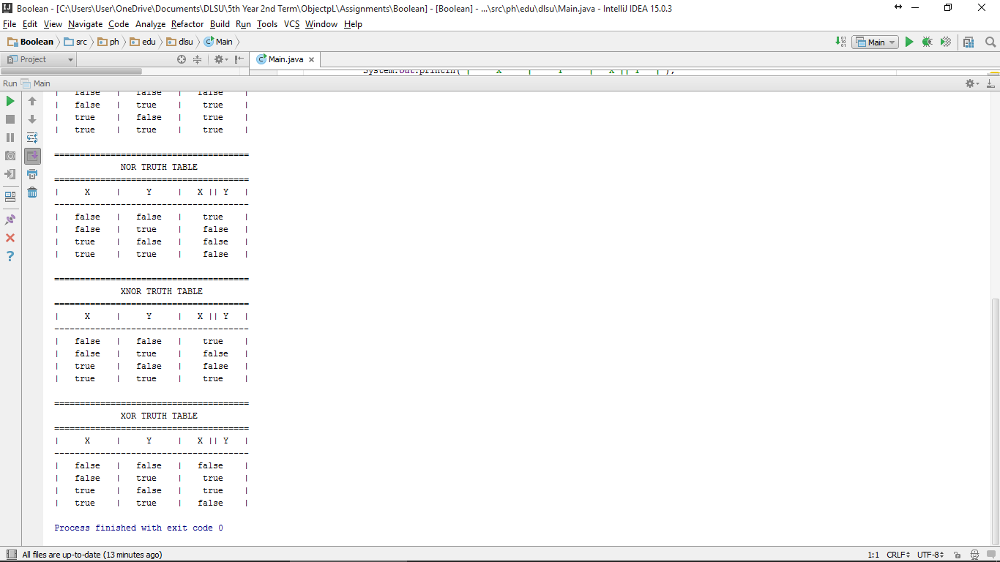

#BooleanTable

Truth Tables

#ScreenShots




#SourceCode
```
package ph.edu.dlsu;

public class Main {

    public static void main(String[] args) {

                boolean X = true;
                boolean Y = false;

                System.out.println("The value of X is " + X);
                System.out.println("The value of Y is " + Y);

                boolean Z = !X;
                System.out.println("The value of Z is " + Y);

                System.out.println("");
                System.out.println("======================================");
                System.out.println("            AND TRUTH TABLE           ");
                System.out.println("======================================");
                System.out.println("|     X     |     Y     |   X && Y   |");
                System.out.println("--------------------------------------");
                System.out.println("|   "+Y+"   |   "+Y+"   |   "+(Y && Y)+"    |");
                System.out.println("|   "+Y+"   |   "+X+"    |   "+(Y && X)+"    |");
                System.out.println("|   "+X+"    |   "+Y+"   |   "+(X && Y)+"    |");
                System.out.println("|   "+X+"    |   "+X+"    |   "+(X && X)+"     |");

                System.out.println("");
                System.out.println("======================================");
                System.out.println("           NAND TRUTH TABLE           ");
                System.out.println("======================================");
                System.out.println("|     X     |     Y     |   X && Y   |");
                System.out.println("--------------------------------------");
                System.out.println("|   "+Y+"   |   "+Y+"   |    "+!(Y && Y)+"    |");
                System.out.println("|   "+Y+"   |   "+X+"    |    "+!(Y && X)+"    |");
                System.out.println("|   "+X+"    |   "+Y+"   |    "+!(X && Y)+"    |");
                System.out.println("|   "+X+"    |   "+X+"    |   "+!(X && X)+"    |");

                System.out.println("");
                System.out.println("======================================");
                System.out.println("             OR TRUTH TABLE           ");
                System.out.println("======================================");
                System.out.println("|     X     |     Y     |   X || Y   |");
                System.out.println("--------------------------------------");
                System.out.println("|   "+Y+"   |   "+Y+"   |   "+(Y || Y)+"    |");
                System.out.println("|   "+Y+"   |   "+X+"    |    "+(Y || X)+"    |");
                System.out.println("|   "+X+"    |   "+Y+"   |    "+(X || Y)+"    |");
                System.out.println("|   "+X+"    |   "+X+"    |    "+(X || X)+"    |");

                System.out.println("");
                System.out.println("======================================");
                System.out.println("             NOR TRUTH TABLE           ");
                System.out.println("======================================");
                System.out.println("|     X     |     Y     |   X || Y   |");
                System.out.println("--------------------------------------");
                System.out.println("|   "+Y+"   |   "+Y+"   |    "+!(Y || Y)+"    |");
                System.out.println("|   "+Y+"   |   "+X+"    |    "+!(Y || X)+"   |");
                System.out.println("|   "+X+"    |   "+Y+"   |    "+!(X || Y)+"   |");
                System.out.println("|   "+X+"    |   "+X+"    |    "+!(X || X)+"   |");

                System.out.println("");
                System.out.println("======================================");
                System.out.println("             XNOR TRUTH TABLE           ");
                System.out.println("======================================");
                System.out.println("|     X     |     Y     |   X || Y   |");
                System.out.println("--------------------------------------");
                System.out.println("|   "+Y+"   |   "+Y+"   |    "+!(Y ^ Y)+"    |");
                System.out.println("|   "+Y+"   |   "+X+"    |    "+!(Y ^ X)+"   |");
                System.out.println("|   "+X+"    |   "+Y+"   |    "+!(X ^ Y)+"   |");
                System.out.println("|   "+X+"    |   "+X+"    |    "+!(X ^ X)+"    |");

                System.out.println("");
                System.out.println("======================================");
                System.out.println("             XOR TRUTH TABLE           ");
                System.out.println("======================================");
                System.out.println("|     X     |     Y     |   X || Y   |");
                System.out.println("--------------------------------------");
                System.out.println("|   "+Y+"   |   "+Y+"   |   "+(Y ^ Y)+"    |");
                System.out.println("|   "+Y+"   |   "+X+"    |    "+(Y ^ X)+"    |");
                System.out.println("|   "+X+"    |   "+Y+"   |    "+(X ^ Y)+"    |");
                System.out.println("|   "+X+"    |   "+X+"    |   "+(X ^ X)+"    |");

    }
}
```
